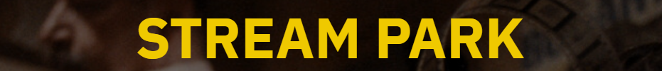

    <h3>About me</h3>

  
  

    
Harder

    
Better

    
Faster

    
Stronger

  

    <h2>Technology Stack</h2>
     
    
    
    
    
    
    
    
    
    
    
    
    
    
    
    

 <h2>GitHub Stats</h2>
    

        
        
    

    <h2>software developer camp</h2>
    <h3>최종 프로젝트</h3>
    <h5>2023.01.30 ~ 2023.07.20</h5>
    
    <h6>(위 이미지를 누르시면 상세 페이지로 이동합니다.)<h6>
    <h5>비대면 시대 이후 OTT(Over-The-Top) 서비스의 수요 증가 및 고객들의 편리하고 쾌적한 컨텐츠 이용 요구에 따라 OTT 서비스 플랫폼 구축을 통하여 신규 회원가입 및 원활한 컨텐츠 이용환경을 제공하고자 함. </h5>

<!-- ### Hi there 👋 -->

<!--
**kim333333d/kim333333d** is a ✨ _special_ ✨ repository because its `README.md` (this file) appears on your GitHub profile.

Here are some ideas to get you started:

- 🔭 I’m currently working on ...
- 🌱 I’m currently learning ...
- 👯 I’m looking to collaborate on ...
- 🤔 I’m looking for help with ...
- 💬 Ask me about ...
- 📫 How to reach me: ...
- 😄 Pronouns: ...
- ⚡ Fun fact: ...
-->
